# dsh-doctor — 修复 DeepSeek Harness 启动报错 `cannot resolve profile bundle` 与 web profile 安装失败（pnpm allowBuilds / ERR_PNPM_GIT_DEP_PREPARE / 不支持的 JSON schema）

[English](./README.md) · 中文文档

[](https://github.com/gxinxing/dsh-doctor/actions) [](https://github.com/gxinxing/dsh-doctor/stargazers) [](https://github.com/gxinxing/dsh-doctor/releases) [](LICENSE)

> 一个零依赖的微型诊断工具，专为 [DeepSeek Harness](https://github.com/deepseek-ai/deepseek-harness)（`dsh`）而生。一条命令告诉你 **为什么 `dsh web`（或任意 profile）在更新后无法启动**，而 `dsh-doctor fix` 还能顺手把它修好。

如果你是从搜索以下错误之一进来的，那就找对地方了：

- `Error: dsh: cannot resolve profile bundle "@deepseek-ai/dsh-tool-read-prd" from the dsh installation or .../profiles/web`
- `ERR_PNPM_GIT_DEP_PREPARE_NOT_ALLOWED … needs to execute build scripts but is not in the "allowBuilds" allowlist`
- `unsupported JSON schema: schema.properties.metadata.required must be true when present`
- `unsupported JSON schema: schema.properties.metadata.additionalProperties must be explicitly true or false`
- `dsh plugin … pnpm not found` / `dsh plugin` 在通过 corepack 下载 pnpm 时卡死

**关键词（SEO）：** DeepSeek Harness, dsh, cannot resolve profile bundle, profile bundle, pnpm allowBuilds, ERR_PNPM_GIT_DEP_PREPARE_NOT_ALLOWED, git 依赖 commit 漂移, corepack pnpm shim 卡死, 不支持的 JSON schema, dsh-tools schema 编译器, web profile 安装失败。

→ 真实报错日志与 `doctor` 输出对照：[排错示例](examples/troubleshooting.md) · [headless profile 案例](examples/headless-profile.md)。

---

## 为什么会这样（一句话版）

三个「默认安全」的行为叠加在一起，把**错误指向了错误的东西**：

1. **未 pin 的 git 依赖 + 没有 lockfile** → 每次 `pnpm install` 都会把 git 依赖重新解析到一个新 commit。
2. **pnpm `allowBuilds` 是 fail-closed 的** → 它的白名单 key 写死了某个 commit hash；当 hash 漂移，*整个*安装中断，于是 `web/node_modules` 永远建不出来。
3. **Node 优雅的模块回退** → 本地没有 `node_modules` 时，解析会一路上溯到父级 profile 目录，而父级只是缺你本地那个 `file:` 插件 —— 于是报错点名的是*那个*插件，而不是真正坏掉的安装。

还有一个第二层问题：依赖恢复之后，为旧版 `dsh-tools` 写的本地插件会通不过更严格的 schema 编译器（`required` 必须为 `true`；object 必须显式声明 `additionalProperties`）。

### 故障链



## 安装

一行命令（安装到 `~/.local/bin`）：

```bash
curl -fsSL https://raw.githubusercontent.com/gxinxing/dsh-doctor/main/install.sh | bash
```

或者直接取脚本：

```bash
curl -fsSL https://raw.githubusercontent.com/gxinxing/dsh-doctor/main/doctor.sh -o dsh-doctor
chmod +x dsh-doctor
# 也可以直接 clone：
git clone https://github.com/gxinxing/dsh-doctor.git && cd dsh-doctor
```

保持最新：`./doctor.sh update`（或 `dsh-doctor update`）。

> 需要 `bash` 以及一份 DeepSeek Harness 安装。没有其他依赖。

## 用法

```bash
./doctor.sh            # 只读诊断 web profile
./doctor.sh -p tui     # 诊断另一个 profile
./doctor.sh fix        # 用真正的 pnpm 重装该 profile 的依赖
./doctor.sh -p headless fix
```

示例输出：

```
== dsh-doctor: profile 'web' ==
[OK]   dsh installed (0.1.1-rc.2)
[OK]   profile dir: ~/.deep-seek-harness-mcp/services/<hash>/profiles/web
[OK]   node_modules built
[OK]   @deepseek-ai/dsh-tool-read-prd installed
[OK]   pnpm-lock.yaml present (drift pinned)
[OK]   git dependency pinned (drift risk off)
[WARN] PATH pnpm is the corepack shim (dsh plugin hangs on it) — use ~/.npm-global/bin/pnpm
```

### 快速诊断地图（按错误类型）



## `doctor.sh` 检查哪些项

| 检查项 | 捕获的问题 | 修复方式 |
|--------|-----------|----------|
| `node_modules` 是否建成 | 静默回退掩盖了缺失的本地插件 | `pnpm install` |
| 本地 `file:` 插件是否存在 | `cannot resolve profile bundle` | `pnpm install` |
| `pnpm-lock.yaml` 是否存在 | 可复现安装（不漂移） | 提交 lockfile |
| git 依赖是否 pin 住 | `ERR_PNPM_GIT_DEP_PREPARE_NOT_ALLOWED` | pin commit / 用 npm registry 版本 |
| pnpm 是否真身（非 corepack） | `dsh plugin` 卡在下载 pnpm | 用真正的 pnpm 二进制 |

## 它是怎么定位这些东西的（无硬编码）

- Harness 主目录：`$DSH_HOME`，否则回退到 `~/.deep-seek-harness-mcp`。
- Profile 目录：拥有目标 profile 的 `package.json` 的那个 `services/<hash>/profiles/<name>`。
- pnpm：优先用 `~/.npm-global/bin/pnpm`（或 `npm prefix -g`）而非 corepack shim。

## schema 修复（针对本地插件）

当你看到 `unsupported JSON schema`，编辑你插件的工具 schema：

- 每个 `object` 必须显式设置 `additionalProperties: true`（或 `false`）；
- `required` 出现时只能为 `true`（`required: false` 会被拒绝）。

## 贡献

欢迎 PR —— 尤其是更多错误类型的匹配逻辑。请保持 POSIX `bash`、零依赖。

## 许可证

MIT —— 见 [LICENSE](./LICENSE)。
